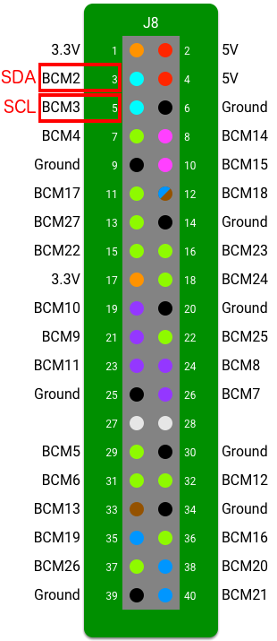

### Introduction

In the previous exercise, you wrote data to an LED using Android Things and made it blink 🚨 Amazing work! 
For this upcoming task, you will now learn about reading data from a temperature sensor using Inter-Integrated Circuit or more commonly referred to as I2C. I2C is a bus protocol allowing a master to control multiple slave devices such as sensors or actuators, connected to this bus.

### Inter-Integrated Circuit (I2C)

As mentioned above, I2C is a bus protocol that allows a master to control several peripheral devices using a simple data payload. When designing your IOT system, common sensors and actuators you would use include accelerometers, thermometers, LCD displays, and motor drivers. 

I2C is a synchronous serial interface, which means that it relies on a shared clock signal to synchronise data transfer between devices. The device in control of triggering the clock signal is known as the **master**. All other connected peripherals are known as **slaves**. Each device is connected to the same set of data signals to form a bus.

I2C devices connect using a 3-Wire interface consisting of:

* Shared clock signal (SCL)
* Shared data line (SDA)
* Common ground reference (GND)

Also note that I2C is **half-duplex** meaning that it only communication between master and slave can occur in both directions but cannot occur simultaenuously. The master initiates the communication and the slave must respond once the transmission is complete.  
Each device must have a unique address to disambiguate the commands sent. Some devices use the notion of register (also called commands), allowing you to select a memory address to read from/write to. The datasheet for your device will explain what each register is used for. Opening an I2C device takes ownership of it for the whole system, preventing anyone else from opening/accessing this device until you call `close()`. Forgetting to call `close()` will prevent anyone including the same process or app from using the device.

For more information, please refer to https://developer.android.com/things/sdk/pio/i2c.html

# Test




```    
private lateinit var i2cDevice: I2cDevice
       
       override fun onStart() {
           super.onStart()
           i2cDevice = PeripheralManagerService().openI2cDevice("I2C1", ADDRESS)
   
   
           while (true) {
   
               val array = ByteArray(1)
               i2cDevice.write(array, 1)
   
               val input = ByteArray(1)
               i2cDevice.read(input, 1)
   
               val temperature: Int = input[0].toInt() and 0xff
               Log.e("Sensor", "$temperature")
   
               Thread.sleep(3000)
           }
           
       }
   
       override fun onDestroy() {
           super.onDestroy()
           i2cDevice.close()
       }
       ```
